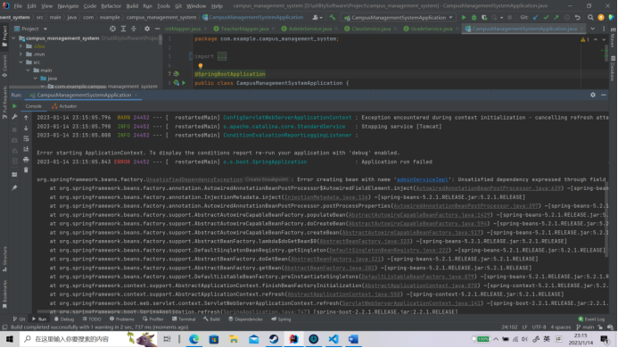

# campus_management_system
校园管理系统：主要是以年级、班级为单位，进行老师和学生信息记录和统计功能。项目采用前后端分离架构思想，后端采用SpringBoot+MybatisPlus框架实现数据存储等服务。存储层使用高性能的MySQL，服务器使用SpringBoot内置的Tomcat9.x，项目构建工具使用Maven来管理jar包和项目构建。

问题汇总:
### 1 Mapper扫描报错

**图片：**

**描述：**

加入Mapper之后项目无法运行

•**报错：**

Unsatisfied dependency expressed through field 'baseMapper'; nested exception is org.springframework.beans.factory.NoSuchBeanDefinitionException: No qualifying bean of type 'com.example.campus_management_system.mapper.AdminMapper' available: expected at least 1 bean which qualifies as autowire candidate.

•**原因：**
运行时没有扫描到Mapper文件的包

•**解决方案：**
在启动类中加入注解 扫描到包即可解决

